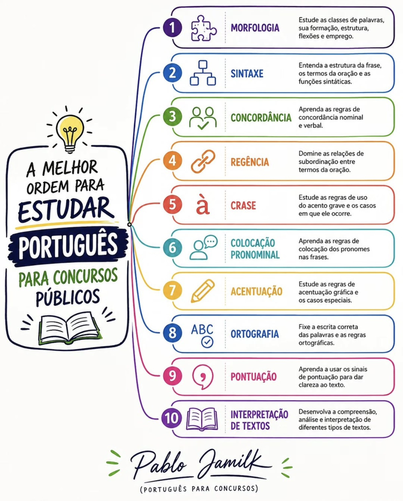

 # Estudos para Concursos

Bem-vindo ao meu acervo de estudos.

## Objetivo
Organizar materiais para revisão e preparação para concursos públicos.

### **Disciplinas estudadas**

  - Português
  - Informática
  - Constitucional
  - Direito administrativo
  - Leis Especiais
  - Raciocínio Lógico
  - Administração Geral
  - Processo administrativo: Lei 9.784/99
  - Improbidade administrativa: Lei 8.429/92
  - Nova lei de licitações (lei 14.133/2021)

  ### observação

  

 
 
 
